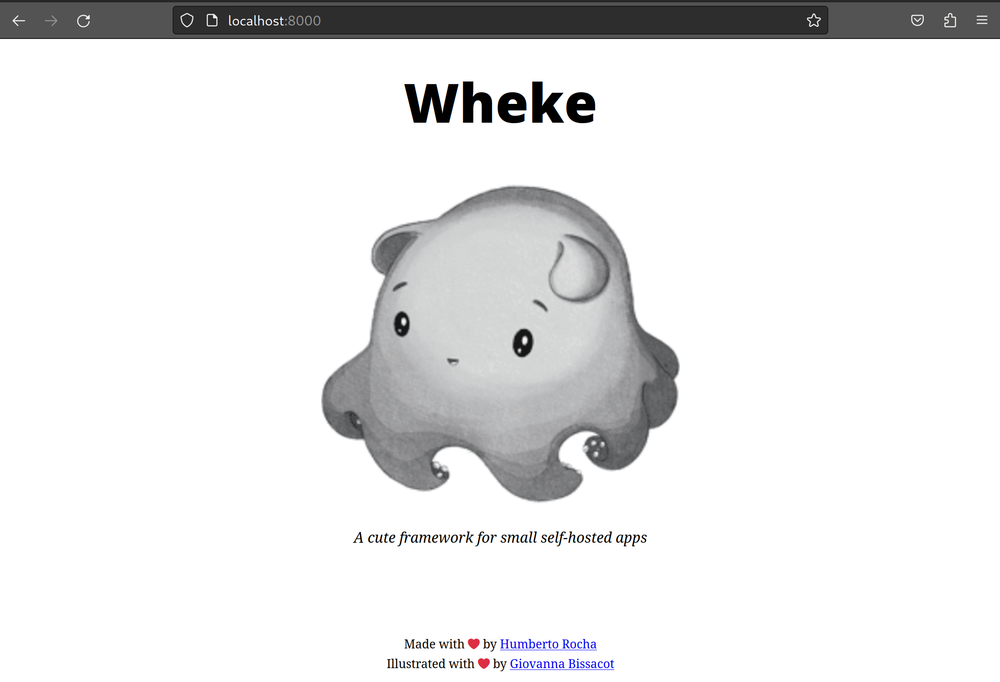

<p align="center">
  </a>
</p>

<p align="center">
  <em>A cute framework for small self-hosted apps</em>
  <br/>
  <em><sup><sub>artwork by <a href="https://bissgigi.art/">@bissgigi</a></sub></sup></em>
</p>

<p align="center">
  <a href="https://github.com/humrochagf/wheke/actions">
    
  </a>
  <a href="https://pypi.org/project/wheke">
    
  </a>
  <a href="https://pypi.org/project/wheke">
    
  </a>
</p>

---

# Introduction

**Wheke** is an opinionated framework to build small scale self-hosted applications and it stands on top of well known packages:

- [FastAPI](https://fastapi.tiangolo.com/) to build the web services.
- [svcs](https://svcs.hynek.me/) to have a robust service registry.
- [Typer](https://typer.tiangolo.com/) to build great cli.
- [Pydantic](https://docs.pydantic.dev/latest/) to build schemas and `.env` based settings.
- [Rich](https://rich.readthedocs.io/en/stable/) to make your app shine.

It aims to provide you:

- An opinionated structure to write you apps.
- Modular architecture by plugging Pods to it.
- Self contained by default.
- Stateless and lazy loading when possible.
- Nosql friendly structure.
- Less boilerplate and more fun.

Wheke is also inspired by [Django](https://www.djangoproject.com/) and recognises its strengths.

If you are looking to build a **self-hosted SQL based app** and don't want to decide each bit of your stack, you'll probably be better served with **Django**.

If you want to **customize** all of your stack, **FastAPI** is the way to go.

If you are looking for **something in between**, then give **Wheke** a spin and see if you like it.

## Installation

To install Wheke run:

```shell
pip install wheke
```

Then you need a ASGI web server to serve the FastAPI app created by Wheke:

```shell
pip install uvicorn[standard]
```

## Example App

To see how a Wheke app in a single file looks like let's create a `main.py` file and add a route to show a timezone aware clock:

```python title="File: main.py"
from datetime import datetime, timezone
from zoneinfo import ZoneInfo, ZoneInfoNotFoundError

from fastapi import APIRouter, HTTPException, status
from wheke import Pod, Wheke
from wheke.demo import demo_pod

router = APIRouter()


@router.get("/clock")
def clock(tz: str | None = None) -> dict:
    try:
        if tz:
            zone_info = ZoneInfo(tz)
        else:
            zone_info = None
    except ZoneInfoNotFoundError:
        raise HTTPException(
            status_code=status.HTTP_400_BAD_REQUEST,
            detail="Invalid timezone",
        )

    return {"clock": datetime.now(timezone.utc).astimezone(zone_info)}


my_pod = Pod("my-pod", router=router)

wheke = Wheke()
wheke.add_pod(demo_pod)
wheke.add_pod(my_pod)

app = wheke.create_app()
```

To start the server run:

```shell
uvicon main:app --reload
```

Now you can check the app at [http://127.0.0.1:8000](http://127.0.0.1:8000)



You can also check the created clock endpoint at [http://localhost:8000/clock?tz=America/Montreal](http://localhost:8000/clock?tz=America/Montreal) and the response should look like this:

```json
{"clock": "2023-12-09T20:55:35.194766-05:00"}
```

As any **FastAPI** app you have built-in api docs at [http://localhost:8000/docs](http://localhost:8000/docs)
